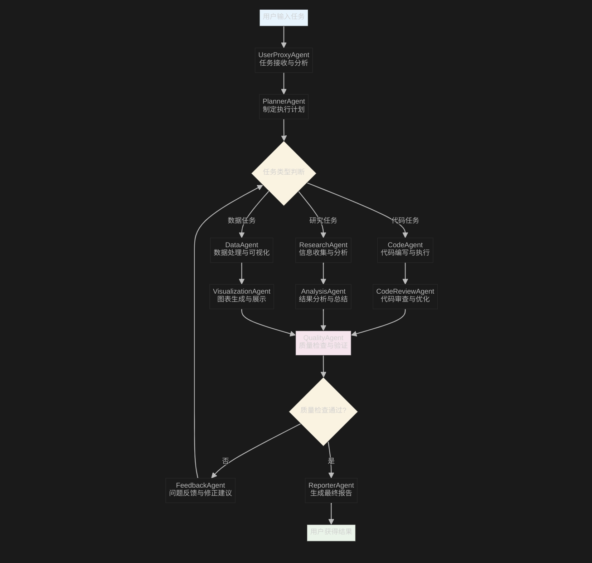

# 第二节课大纲：AutoGen框架基础与多Agent工作流

## 一、基础知识复习

### 1. Python基础快速回顾
- Python数据类型与控制结构回顾
- 函数定义与模块导入最佳实践
- 异常处理与调试技巧
- 异步编程基础（async/await）

### 2. JSON输出与结构化数据处理
- JSON Schema设计与验证
- Pydantic模型定义与数据验证
- 结构化输出的错误处理
- 数据序列化与反序列化最佳实践

### 3. FunctionCall深度回顾
- FunctionCall的工作原理详解
- Tool Schema的高级设计模式
- 错误处理与重试机制
- 性能优化与调试技巧

---

## 二、AutoGen框架基础

### 1. AutoGen框架概述
- AutoGen是什么？核心概念与架构
- Agent、Conversation、Workflow等关键组件
- AutoGen与其他AI框架的对比
- 安装配置与环境准备

### 2. Agent基础概念
- Agent的定义与分类（UserProxyAgent、AssistantAgent、GroupChatManager等）
- Agent角色设计与system prompt编写
- Agent配置与个性化定制
- Agent间通信机制

### 3. 单Agent工具调用
- 如何为Agent注册自定义工具
- 工具调用的生命周期管理
- 常见工具类型：文件操作、网络请求、数据处理
- 工具调用的错误处理与日志记录

### 4. 实战演示：单Agent工具调用
- 现场演示：创建一个能调用多种工具的Agent
- 工具链设计与组合使用
- 调试与性能监控

---

## 三、多Agent工作流编排

### 1. 多Agent协作模式
- Sequential Chat：顺序对话模式
- Group Chat：群聊协作模式
- Nested Chat：嵌套对话模式
- Custom Workflow：自定义工作流

### 2. AutoGen GraphFlow架构

#### GraphFlow工作流程图

**工作流说明：**
该图展示了AutoGen框架中的多Agent协作流程，从用户输入任务开始，经过任务分析、计划制定、专业Agent处理、质量检查，最终生成报告的完整流程。支持代码任务、研究任务和数据任务三种不同类型的处理路径。

### 3. 工作流设计模式
- 流水线模式（Pipeline Pattern）
- 分支合并模式（Fork-Join Pattern）
- 循环优化模式（Iterative Refinement Pattern）
- 人工干预模式（Human-in-the-Loop Pattern）

### 4. 高级特性
- 动态Agent生成与管理
- 工作流状态管理与持久化
- 分布式Agent部署
- 性能监控与日志分析

### 5. 实战演示：多Agent协作项目
- 现场演示：构建一个完整的多Agent工作流
- 场景：自动化数据分析报告生成系统
- 涉及角色：数据获取Agent、分析Agent、可视化Agent、报告生成Agent
- 错误处理与工作流回滚机制

---

## 四、进阶主题

### 1. 性能优化
- Agent并发执行策略
- 内存管理与资源优化
- 缓存策略与数据共享
- 监控指标与性能调优

### 2. 安全与可靠性
- Agent权限管理
- 敏感数据处理
- 错误恢复机制
- 系统稳定性保障

### 3. 扩展与集成
- 自定义Agent类型开发
- 第三方工具集成
- 企业级部署方案
- CI/CD集成策略

---

## 课后实践

### 必做练习
1. 创建一个包含3个Agent的简单工作流
2. 实现一个能调用外部API的工具Agent
3. 设计一个具有错误处理机制的多Agent系统

### 选做挑战
1. 构建一个智能客服系统（多Agent协作）
2. 实现一个自动化测试工作流
3. 设计一个能够自我优化的Agent系统

### 推荐资源
- AutoGen官方文档与示例
- MultiAgent系统设计模式
- 大模型Agent应用案例分析
- 工作流引擎对比研究 